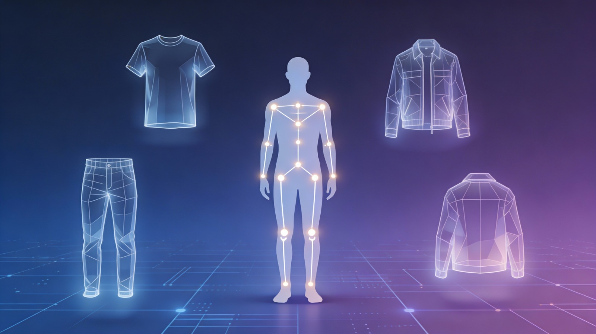

<div align="center">
  
</div>

<h1 align="center">Virtual Fitting Room</h1>



<div align="center" style="font-family: 'Segoe UI', sans-serif; line-height: 1.6; margin-top: 30px;">
  <h2 style="font-size: 28px; margin-bottom: 10px;">
    Asignatura: <span>Visión por Computador</span>
  </h2>
  <p style="font-size: 18px; margin: 4px 0;">
    Grado en Ingeniería Informática
  </p>
  <p style="font-size: 18px; margin-top: 10px;">
    Curso <strong>2025 / 2026</strong>
  </p>
</div>

<h2 align="center">Autores</h2>

- Javier Castilla Moreno
- Asmae Ez Zaim Driouch

<h2 align="center">Descripción del Proyecto</h2>

Sistema de probador virtual en tiempo real basado en tecnologías web que permite a los usuarios probarse ropa de forma virtual mediante detección de pose corporal y renderizado 3D. La aplicación integra visión por computador, reconocimiento de gestos y animación esquelética para superponer prendas virtuales sobre el cuerpo del usuario capturado por cámara web.

<h2 align="center">Tecnologías utilizadas</h2>

[](https://angular.dev/)
[](https://www.typescriptlang.org/)
[](https://threejs.org/)
[](https://developers.google.com/mediapipe)
[](https://www.khronos.org/webgl/)
[](https://rxjs.dev/)
[](https://nodejs.org/)
[](https://www.clo3d.com/)
[](https://www.blender.org/)
[](https://www.khronos.org/gltf/)

<div align="center">
  <h2>🎬 Vídeo promocional</h2>
  <video src="https://github.com/user-attachments/assets/6d4e40c2-5ed7-4543-9f2d-588f713913c0" width="600" controls></video>
</div>

## Características Principales

### Detección de Pose y Manos en Tiempo Real
- **MediaPipe Pose**: Detecta 33 puntos clave del cuerpo humano (worldLandmarks 3D)
- **MediaPipe Hands**: Detecta 21 landmarks por mano para control gestual
- **MediaPipe GestureRecognizer**: Reconoce gestos predefinidos (Closed_Fist, Open_Palm)
- Procesamiento en GPU para máximo rendimiento

### Sistema de Gestos Personalizado
- **Pointing**: Dedo índice extendido para seleccionar elementos
- **Swipe con puño cerrado**: Navegación del carrusel mediante deslizamiento horizontal
  - Cierra el puño → Desliza hacia izquierda/derecha → Abre la mano para confirmar
  - Detección de velocidad e intensidad del swipe
  - Cooldown de 800ms entre swipes
- **Confirmación por tiempo**: Mantener pointing 1.5s para activar

### Skeleton Retargeting Avanzado
- Animación basada en **quaternions** para evitar gimbal lock
- Mapeo automático de 33 landmarks MediaPipe a bones GLTF
- Detección automática de esqueletos mediante `SkeletonAutoDetectService`
- Suavizado con **SLERP** (Spherical Linear Interpolation)
- Soporte para upper body (brazos) y lower body (piernas)
- Búsqueda flexible de bones por múltiples patrones de nombres

### Sistema de Escalado Inteligente
- Calibración inicial basada en ancho de hombros/caderas del usuario
- Proyección de coordenadas 2D a espacio 3D de la escena
- Cálculo de distancias entre bones del modelo para escalado proporcional
- Factor de escala adaptativo con memoria (referenceWidth)
- Suavizado mediante `lerp` para transiciones fluidas

### Pipeline de Creación 3D
- **CLO3D**: Diseño profesional de prendas con simulación física de telas
- **Blender**: Rigging de esqueletos (naming: LeftShoulder, LeftElbow, LeftHip, LeftKnee, etc.)
- Exportación a **GLTF/GLB** con texturas PBR
- Script Node.js para generación automática del catálogo de modelos

## Cómo usar

### Primer paso: clonar este repositorio
```bash
git clone "https://github.com/[tu-usuario]/virtual-fitting-room"
cd virtual-fitting-room
```

### Segundo paso: Instalar dependencias
> [!NOTE]
> Este proyecto requiere Node.js 18+ y npm 9+.

```bash
npm install
```

### Tercer paso: Generar el catálogo de modelos
Este paso es **obligatorio** para que la aplicación pueda cargar los modelos 3D:

```bash
node generate-models-list.mjs
```

Este script escanea la carpeta `public/assets/models/` y genera automáticamente `models-list.json` con la estructura:

```
models/
├── male/
│   ├── upper-body/
│   │   └── tops/
│   │       ├── modelo1.glb
│   │       └── modelo2.glb
│   └── lower-body/
│       └── bottoms/
└── female/
    └── ...
```

> [!IMPORTANT]
> Ejecuta `node generate-models-list.mjs` cada vez que añadas o elimines modelos de la carpeta `public/assets/models/`.

> [!TIP]
> En [este enlace](https://drive.google.com/file/d/1Bqqf--KZ43bl9S04Ct9SB4OcyUp7VW2g/view?usp=sharing) se puede conseguir una carpeta de assets lista para la carga de diferentes modelos 3D con imagen incluida.
> Basta con descargar el archivo .ZIP y dejarlo bajo el dirctorio public/ del proyecto

### Cuarto paso: Ejecutar la aplicación en modo desarrollo
```bash
ng serve
```

La aplicación estará disponible en `http://localhost:4200/`

> [!IMPORTANT]
> Es necesario permitir el acceso a la cámara web cuando el navegador lo solicite.

### Build de producción
```bash
ng build --configuration production
```

Los archivos de producción se generarán en el directorio `dist/`.

## Estructura del Proyecto

```
├── generate-models-list.mjs      # Script para generar catálogo de modelos
├── public/
│   └── assets/
│       ├── models/               # Modelos 3D organizados por género/categoría/tipo
│       │   ├── male/
│       │   ├── female/
│       │   └── unisex/
│       └── models-list.json      # Catálogo generado automáticamente
└── src/
    ├── app/
    │   ├── components/
    │   │   ├── camera-feed/              # Captura de video
    │   │   ├── scene-viewer/             # Renderizado 3D con Three.js
    │   │   ├── gender-selector/          # Selector de género inicial
    │   │   ├── category-sidebar/         # Panel lateral de categorías
    │   │   └── gallery-bar/              # Carrusel de prendas
    │   ├── services/
    │   │   ├── mediapipe.ts              # MediaPipe Pose + Hands + GestureRecognizer
    │   │   ├── gesture-detector.service.ts       # Detección de gestos personalizada
    │   │   ├── garment-manager.ts                # Gestión y transformación de prendas
    │   │   ├── skeleton-retarget.service.ts      # Retargeting con quaternions
    │   │   ├── skeleton-auto-detect.service.ts   # Detección automática de bones
    │   │   ├── garment-transform.service.ts      # Transformaciones 3D
    │   │   ├── coordinate-transformer.service.ts # Conversión de coordenadas
    │   │   ├── garments-catalog.service.ts       # Carga del catálogo
    │   │   ├── model-loader.ts                   # Carga de modelos GLTF
    │   │   ├── debug-logger.service.ts           # Modo debug
    │   │   └── threejs.ts                        # Configuración Three.js
    │   └── services/recognizers/
    │       ├── pointing-gesture.recognizer.ts    # Reconocedor de pointing
    │       ├── swipe-gesture.recognizer.ts       # Reconocedor de swipe
    │       ├── gesture-recognizer.interface.ts   # Interfaz común
    │       ├── finger-detector.ts                # Detección de dedos extendidos
    │       └── cooldown-manager.ts               # Gestión de cooldowns
    └── domain/
        ├── enums/                # GarmentCategory, GarmentType, Gender
        └── model/                # Modelos de datos (Garment)
```

<h1 align="center">Arquitectura del Sistema</h1>

## Flujo de Datos

```
Cámara Web → MediaPipeService (Pose + Hands + Gestures)
                        ↓
            ┌───────────┴───────────┐
            ↓                       ↓
    PoseLandmarks (2D/3D)    HandLandmarks
            ↓                       ↓
    GarmentManagerService    GestureDetectorService
            ↓                       ↓
    SkeletonRetargetService  PointingRecognizer / SwipeRecognizer
            ↓                       ↓
    Three.js Scene          UI Interactions (select, swipe)
            ↓
    Renderizado Final
```

## Flujo de Interacción del Usuario

### 1. Pantalla de Selección de Género
Al iniciar la aplicación, el usuario se encuentra con tres opciones representadas con emojis:
- 👨 Masculino (male)
- 👩 Femenino (female)
- ⚧ Unisex

**Selección**: Apuntar con el dedo índice hacia la opción deseada y mantener 1.5 segundos.

### 2. Pantalla Principal de Prueba Virtual

La interfaz se divide en tres zonas:

#### Centro: Visualización en Tiempo Real
- Feed de la cámara con el usuario
- Renderizado 3D de las prendas superpuestas sobre el cuerpo
- Seguimiento continuo de pose corporal (33 landmarks)
- Animación esquelética sincronizada con movimientos del usuario

#### Panel Lateral Derecho (CategorySidebar)
Botones de control interactivos:
- **Categorías**: Upper Body, Lower Body, Full Body, Shoes
- **Botón de género**: Permite volver al selector de género
- **Interacción**: Pointing con confirmación por tiempo (1.5s)

#### Carrusel Inferior (GalleryBar)
- Miniaturas de todas las prendas disponibles en la categoría seleccionada
- **Navegación mediante Swipe con puño cerrado**:
  1. Cierra el puño (detecta `Closed_Fist` con score ≥ 0.55)
  2. Mantén el puño cerrado durante 2+ frames
  3. Desliza horizontalmente (threshold: 25% del tamaño de la palma)
  4. Abre la mano (`Open_Palm`) para confirmar
  5. Cooldown de 800ms antes del siguiente swipe
- **Selección de prenda**: Pointing + Hold 1.5s sobre miniatura

## Componentes Principales

### MediaPipeService
Inicializa tres modelos de MediaPipe:

```typescript
// Pose: Detecta 33 landmarks del cuerpo
this.poseLandmarker = await PoseLandmarker.createFromOptions(vision, {
  baseOptions: {
    modelAssetPath: 'pose_landmarker_lite.task',
    delegate: 'GPU'
  },
  runningMode: 'VIDEO',
  numPoses: 1
});

// Hands: Detecta hasta 2 manos con 21 landmarks cada una
this.handLandmarker = await HandLandmarker.createFromOptions(vision, {
  baseOptions: {
    modelAssetPath: 'hand_landmarker.task',
    delegate: 'GPU'
  },
  runningMode: 'VIDEO',
  numHands: 2
});

// GestureRecognizer: Reconoce gestos predefinidos
this.gestureRecognizer = await GestureRecognizer.createFromOptions(vision, {
  baseOptions: {
    modelAssetPath: 'gesture_recognizer.task',
    delegate: 'GPU'
  },
  runningMode: 'VIDEO',
  numHands: 2
});
```

**Emisión de datos**: Utiliza RxJS Observables (`poseLandmarks$`, `poseWorldLandmarks$`)

### GestureDetectorService
Servicio central que coordina los reconocedores de gestos:

```typescript
private swipeRecognizer = new SwipeGestureRecognizer();
private pointingRecognizer = new PointingGestureRecognizer();

// Cooldowns independientes
private swipeCooldown = new CooldownManager(800);   // 800ms entre swipes
private staticCooldown = new CooldownManager(1500); // 1500ms entre pointings
```

**Lógica de priorización**:
1. Si hay swipe activo → bloquea otros gestos
2. Si swipe completo → emite evento y activa cooldown
3. Si no hay swipe → procesa pointing

### GarmentManagerService
Gestiona la carga, transformación y renderizado de prendas:

**Configuración por categoría**:
```typescript
private categoryConfig = {
  [GarmentCategory.UPPER_BODY]: {
    widthFactor: 1.0,
    anchorLandmarks: [11, 12],  // Hombros
    scaleLandmarks: [11, 12]
  },
  [GarmentCategory.LOWER_BODY]: {
    widthFactor: 0.9,
    anchorLandmarks: [23, 24],  // Caderas
    scaleLandmarks: [23, 24]
  }
};
```

**Proceso de actualización**:
1. Calcula ancho de referencia (hombros o caderas del usuario en 2D)
2. Proyecta a espacio 3D considerando distancia cámara-plano
3. Escala prenda proporcionalmente a distancia entre bones del modelo
4. Posiciona en coordenadas del torso/caderas
5. Calcula rotaciones 3D (rotY basada en orientación del cuerpo)
6. Si tiene skeleton → llama a `SkeletonRetargetService.updateSkeleton()`

### SkeletonRetargetService
Implementa el retargeting de esqueleto basado en quaternions:

**Inicialización** (primera vez que se carga una prenda con skeleton):
```typescript
// Búsqueda flexible de bones con múltiples patrones
const leftShoulder = this.findBone(skeleton, [
  'LeftShoulder', 'leftshoulder', 'shoulder_l', 'l_shoulder'
]);

// Guardado de bind pose (quaternion inicial)
leftShoulderBindQuat: leftShoulder?.quaternion.clone()
```

**Animación de extremidades** (cada frame):
```typescript
private animateLimb(
  upperBone: THREE.Bone,      // Ejemplo: LeftShoulder
  lowerBone: THREE.Bone,      // Ejemplo: LeftElbow
  upperBindQuat: THREE.Quaternion,
  lowerBindQuat: THREE.Quaternion,
  upperLM: Landmark3D,        // MediaPipe landmark 11 (hombro izq)
  midLM: Landmark3D,          // MediaPipe landmark 13 (codo izq)
  lowerLM: Landmark3D         // MediaPipe landmark 15 (muñeca izq)
): void {
  // 1. Convertir landmarks MediaPipe a coordenadas del rig
  const U = this.toRig(upperLM);  // Invierte X, Y, Z
  const M = this.toRig(midLM);
  const L = this.toRig(lowerLM);

  // 2. Calcular dirección actual del upperBone en espacio mundial
  const currentUpperDir = new THREE.Vector3()
    .subVectors(midWorldPos, upperWorldPos)
    .normalize();

  // 3. Calcular dirección objetivo desde landmarks
  const targetUpperDir = new THREE.Vector3()
    .subVectors(M, U)
    .normalize();

  // 4. Crear quaternion de rotación entre direcciones
  const upperRotWorld = new THREE.Quaternion()
    .setFromUnitVectors(currentUpperDir, targetUpperDir);

  // 5. Convertir a espacio local del bone
  const upperTargetLocalQuat = upperParentQuat.clone()
    .invert()
    .multiply(upperTargetWorldQuat);

  // 6. Aplicar con suavizado (SLERP)
  upperBone.quaternion.slerp(upperTargetLocalQuat, this.smoothing); // 0.3

  // 7. Repetir proceso para lowerBone
}
```

### SwipeGestureRecognizer
Estado complejo con máquina de estados para detectar swipe robusto:

```typescript
enum SwipeState {
  IDLE,           // Esperando puño cerrado
  FIST_DETECTED,  // Puño detectado, confirmando
  FIST_HELD,      // Puño mantenido, midiendo desplazamiento
  WAIT_OPEN       // Swipe completado, esperando apertura de mano
}
```

**Parámetros clave**:
- `MIN_FIST_FRAMES = 2`: Frames consecutivos con puño cerrado para confirmar
- `MIN_SWIPE_DISTANCE_RATIO = 0.25`: Distancia mínima (25% del tamaño de la palma)
- `MIN_GESTURE_SCORE = 0.55`: Confianza mínima del GestureRecognizer
- `VELOCITY_THRESHOLD`: Clasifica intensidad (1-4) según velocidad

**Cálculo de velocidad e intensidad**:
```typescript
const distance = Math.abs(landmarks[0].x - s.initialX);
const elapsed = (Date.now() - s.startTime) / 1000;
const velocity = distance / Math.max(elapsed, 1e-3);

// Intensidad basada en velocidad
if (velocity >= 1.2) return 4;      // Very Fast
if (velocity >= 0.8) return 3;      // Fast
if (velocity >= 0.5) return 2;      // Medium
return 1;                           // Slow
```

## Sistema de Coordenadas

### MediaPipe → Three.js
MediaPipe devuelve coordenadas normalizadas (0.0 - 1.0):

```typescript
// 1. Pose 2D (landmarks): x, y normalizados en imagen
pose2d[11].x  // Hombro izquierdo X (0.0 = izquierda, 1.0 = derecha)
pose2d[11].y  // Hombro izquierdo Y (0.0 = arriba, 1.0 = abajo)

// 2. Pose 3D (worldLandmarks): x, y, z en metros desde cadera
pose3d[11].x  // X en metros (negativo = izquierda, positivo = derecha)
pose3d[11].y  // Y en metros (positivo = arriba, negativo = abajo)
pose3d[11].z  // Z en metros (negativo = hacia cámara, positivo = alejándose)
```

**Proyección a escena Three.js**:
```typescript
// Calcular tamaño del plano de proyección
const dist = camera.position.z - zPlane;  // Distancia cámara a plano
const vFov = THREE.MathUtils.degToRad(camera.fov);
const planeHeight = 2 * dist * Math.tan(vFov / 2);
const planeWidth = planeHeight * camera.aspect;

// Convertir coordenadas normalizadas a unidades Three.js
const x = (pose2d.x - 0.5) * planeWidth;   // Centrado en 0
const y = (0.5 - pose2d.y) * planeHeight;  // Invertir Y
const z = zPlane + pose3d.z * 2.5;          // Factor de escala Z
```

### Conversión MediaPipe → Rig (Skeleton)
```typescript
private toRig(lm: Landmark3D): THREE.Vector3 {
  const sx = this.mirrored ? 1 : -1;  // Espejo opcional
  return new THREE.Vector3(
    sx * lm.x,   // X: mantener o invertir
    -lm.y,       // Y: invertir (MediaPipe Y+ = abajo, Three.js Y+ = arriba)
    -lm.z        // Z: invertir (MediaPipe Z+ = lejos, Three.js Z+ = cerca)
  );
}
```

## Script de Generación de Catálogo

El script `generate-models-list.mjs` es crucial para el funcionamiento del sistema:

```javascript
async function generateModelsList() {
  const modelsPath = join(__dirname, 'public', 'assets', 'models');
  const outputPath = join(__dirname, 'public', 'assets', 'models-list.json');

  const modelsByGender = {};

  // Escanear estructura: gender/category/type/
  const genders = await readdir(modelsPath, { withFileTypes: true });

  for (const genderDir of genders) {
    const categories = await readdir(genderPath, { withFileTypes: true });

    for (const categoryDir of categories) {
      const types = await readdir(categoryPath, { withFileTypes: true });

      for (const typeDir of types) {
        const files = await readdir(typePath);
        const modelFiles = files
          .filter(f => f.endsWith('.glb') || f.endsWith('.gltf'))
          .map(f => f.replace(/\.(glb|gltf)$/i, ''));

        modelsByGender[genderName][categoryName][typeName] = modelFiles;
      }
    }
  }

  // Guardar JSON
  await writeFile(outputPath, JSON.stringify(modelsByGender, null, 2));
}
```

**Estructura generada**:
```json
{
  "male": {
    "upper-body": {
      "tops": ["tshirt_01", "jacket_02"]
    },
    "lower-body": {
      "bottoms": ["jeans_01", "shorts_02"]
    }
  },
  "female": {
    "upper-body": {
      "tops": ["blouse_01"]
    }
  }
}
```

Este JSON es consumido por `GarmentsCatalogService` para cargar dinámicamente las prendas disponibles.

## Sistema de Bucles de Renderizado

El proyecto mantiene tres loops independientes sincronizados:

1. **CameraFeed**: 30 FPS vía `requestAnimationFrame`
   - Captura frames de video
   - Envía a MediaPipe para procesamiento

2. **SceneViewer**: 60 FPS vía `requestAnimationFrame`
   - Renderiza escena Three.js
   - Actualiza transformaciones de prendas
   - Ejecuta animación de skeleton

3. **GestureDetector**: 20 Hz vía `interval(50)` en app.component
   - Procesa landmarks de manos
   - Detecta gestos (pointing, swipe)
   - Emite eventos de UI

**Sincronización**:
- RxJS `Observables` para comunicación entre componentes
- `ChangeDetectorRef.detectChanges()` para updates manuales
- `requestAnimationFrame` alineado con vsync del navegador

<h1 align="center">Modo Debug</h1>

El sistema incluye `DebugLoggerService` activable en tiempo de ejecución:

```typescript
// Activar en consola del navegador
this.debugLogger.setDebugMode(true);

// Logs automáticos:
// • Posición de manos en coordenadas normalizadas
// • Detección de zonas de interacción (pointing)
// • Estado del swipe (IDLE, FIST_DETECTED, FIST_HELD, WAIT_OPEN)
// • Velocidad e intensidad del swipe
// • Rotaciones de bones en grados Euler
// • Distancias entre bones del modelo
```

**Visualización en pantalla**:
- Zonas de interacción expandidas (rectángulos semitransparentes)
- Punto de apuntado actual (círculo)
- Barra de progreso de confirmación por tiempo
- Estado actual del SwipeGestureRecognizer
- FPS y estadísticas de rendering

<h1 align="center">Limitaciones Actuales</h1>

- **Iluminación**: MediaPipe se degrada con iluminación baja o contraluz intenso
- **Múltiples personas**: Solo procesa 1 cuerpo y hasta 2 manos
- **Ajuste automático**: Las prendas no se adaptan al tamaño corporal real (solo escalan proporcionalmente)
- **Oclusiones**: La detección falla si el cuerpo está parcialmente oculto
- **Latencia**: ~100-150ms entre movimiento real y actualización visual
- **Compatibilidad navegadores**: Requiere WebGL 2.0 y WebRTC (Safari limitado)
- **Naming de bones**: Depende de nombres específicos en los modelos GLTF (aunque hay búsqueda flexible)

<h1 align="center">Implementaciones Futuras</h1>

### Sistema de Guardado de Outfits
- LocalStorage para combinaciones favoritas
- Captura de screenshots del outfit virtual
- Compartir via URL o redes sociales

### Modelado 3D del Cuerpo del Usuario
- Fotogrametría para generar modelo 3D personalizado
- Ajuste preciso de prendas según medidas corporales reales
- Simulación física de telas adaptada a la forma del cuerpo

### Detección Automática de Género
- Clasificador ML para eliminar paso manual
- Recomendaciones personalizadas según perfil

### Mejoras de Rendering
- Sombras dinámicas (shadow mapping)
- Reflejos y oclusión ambiental (SSAO)
- Post-procesado (bloom, tone mapping)

### Experiencia Multijugador
- WebRTC para sala virtual compartida
- Chat y sistema de votación en tiempo real

<h1 align="center">Guía de Uso</h1>

> [!TIP]
> Para óptima experiencia: iluminación frontal uniforme, espacio para captura de cuerpo completo, mantener manos visibles para gestos.

### Paso 1: Selecciona tu género
1. Apunta con tu dedo índice hacia una opción (👨 👩 ⚧)
2. Mantén el pointing durante 1.5 segundos
3. Barra de progreso circular indica confirmación

### Paso 2: Explora categorías
1. En el panel derecho, apunta hacia categoría deseada
2. Mantén 1.5s para confirmar
3. Carrusel inferior muestra prendas de esa categoría

### Paso 3: Navega por el carrusel con Swipe
1. **Cierra el puño** firmemente
2. **Desliza horizontalmente** (mínimo 25% del ancho de tu palma):
   - Desliza **derecha** → prenda anterior
   - Desliza **izquierda** → prenda siguiente
3. **Abre la mano** para confirmar el swipe
4. Espera 800ms antes del siguiente swipe

### Paso 4: Selecciona una prenda
1. Apunta con el dedo a la miniatura deseada
2. Mantén pointing durante 1.5s
3. Prenda se carga y aparece sobre tu cuerpo

### Paso 5: Prueba combinaciones
1. Muévete libremente, la prenda seguirá tu pose
2. Cambia de categoría para añadir más piezas
3. Usa botón de género (panel derecho) para cambiar género

**Consejos prácticos**:
- Para swipe: movimiento claro y decidido, no demasiado rápido
- Si falla detección: espera cooldown (800ms swipe / 1500ms pointing)
- Mantén manos a la altura del pecho para mejor reconocimiento

<h1 align="center">Requisitos del Sistema</h1>

### Hardware
- **CPU**: 2+ núcleos (recomendado 4+)
- **GPU**: Compatible con WebGL 2.0
- **Cámara Web**: 640x480 mínimo, 30 FPS
- **RAM**: 4GB mínimo (8GB recomendado)

### Software
- **Navegador**: Chrome 90+, Firefox 88+, Edge 90+ (Safari no recomendado)
- **Node.js**: 18.0.0+
- **npm**: 9.0.0+
- **Angular CLI**: 20.0.0

<h1 align="center">Documentación de interés</h1>

- [Memoria](doc/Trabajo_Final_VC.pdf)
- [Presentación PDF](doc/virual_fitting_room_Defensa_Final.pdf)

<h1 align="center">Bibliografía</h1>

### MediaPipe
- [MediaPipe Pose - Documentación Oficial](https://github.com/google-ai-edge/mediapipe/wiki/MediaPipe-Pose)
- [MediaPipe Hands](https://developers.google.com/mediapipe/solutions/vision/hand_landmarker)
- [MediaPipe Gesture Recognizer](https://developers.google.com/mediapipe/solutions/vision/gesture_recognizer)
- [Bazarevsky, V., et al. (2020). BlazePose: On-device Real-time Body Pose tracking](https://arxiv.org/abs/2006.10204)

### Three.js y GLTF
- [Three.js - Documentación Oficial](https://threejs.org/docs/)
- [GLTF 2.0 Specification](https://www.khronos.org/gltf/)
- [WebGL Fundamentals](https://webglfundamentals.org/)
- [PBR Theory](https://learnopengl.com/PBR/Theory)

### Skeleton Animation
- [Understanding Quaternions](https://eater.net/quaternions)
- [Skeleton Retargeting for Real-time Applications](https://dl.acm.org/doi/10.1145/3305366.3328099)
- [SLERP: Spherical Linear Interpolation](https://en.wikipedia.org/wiki/Slerp)

### Angular y RxJS
- [Angular v20 Documentation](https://angular.dev/)
- [RxJS - Reactive Extensions](https://rxjs.dev/)
- [TypeScript Handbook](https://www.typescriptlang.org/docs/)

### Virtual Try-On
- [Virtual Try-On: A Survey](https://arxiv.org/abs/2111.12447)
- [CLO3D - 3D Fashion Design](https://www.clo3d.com/)
- [Blender Foundation](https://www.blender.org/)

### Computer Vision
- [OpenCV - Camera Calibration](https://docs.opencv.org/4.x/d9/d0c/group__calib3d.html)
- [Coordinate Systems in Computer Vision](https://learnopencv.com/geometry-of-image-formation/)

---

<div align="center">
  <p><strong>Desarrollado como Trabajo Final de Visión por Computador</strong></p>
  <p>Universidad de Las Palmas de Gran Canaria - 2026</p>
</div>
